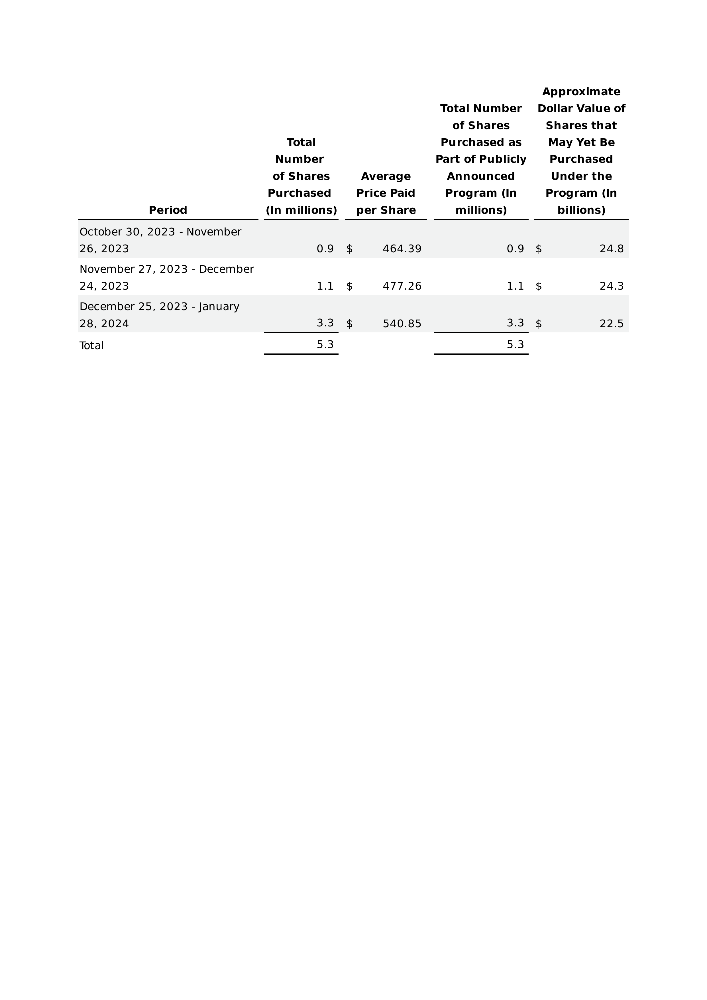

# SEC Filings Parser

A Generic framework to parse the tabular data in sec-filings

## Setup

To set up the environment for the SEC Filings Parser, follow these steps:

1. **Create a new virtual environment using Conda or Pyenv:**

    ```bash
    conda create -n sec-filings-parser python=3.12
    ```

2. **Activate the virtual environment:**

    ```bash
    conda activate sec-filings-parser
    ```

3. **Install the required dependencies:**

    ```bash
    pip install -r requirements.txt
    ```

## Environment Variables

Create a `.env` file in the root directory of your project and add the following environment variables:

```env
OPENAI_API_KEY=<YOUR_OPENAI_KEY_HERE>
POSTGRES_CONN_STRING=<YOUR_POSTGRES_CONNECTION_STRING_HERE>
```

## Running the Orchestrator

To run the orchestrator script, use the following command:

```bash
python orchestrator.py
```

## Sample Image:

### Sample Output JSON
```json
{
  "name": "share_repurchase_program",
  "summary": "Information regarding the share repurchase program over different periods.",
  "columns": [
    "Period",
    "Total Numbers of Shares Purchased (in millions)",
    "Average Price Paid per Share",
    "Total Number of Shares Purchased as Part of Publicly Announced Program (in millions)",
    "Approximate Dollar Value of Shares that May Yet Be Purchased Under the Program (in billions)"
  ],
  "data": [
    {
      "Period": "October 30, 2023 - November 26, 2023",
      "Total Numbers of Shares Purchased (in millions)": 0.9,
      "Average Price Paid per Share": 464.39,
      "Total Number of Shares Purchased as Part of Publicly Announced Program (in millions)": 0.9,
      "Approximate Dollar Value of Shares that May Yet Be Purchased Under the Program (in billions)": 24.8
    },
    {
      "Period": "November 27, 2023 - December 24, 2023",
      "Total Numbers of Shares Purchased (in millions)": 1.1,
      "Average Price Paid per Share": 477.26,
      "Total Number of Shares Purchased as Part of Publicly Announced Program (in millions)": 1.1,
      "Approximate Dollar Value of Shares that May Yet Be Purchased Under the Program (in billions)": 24.3
    },
    {
      "Period": "December 25, 2023 - January 28, 2024",
      "Total Numbers of Shares Purchased (in millions)": 3.3,
      "Average Price Paid per Share": 540.85,
      "Total Number of Shares Purchased as Part of Publicly Announced Program (in millions)": 3.3,
      "Approximate Dollar Value of Shares that May Yet Be Purchased Under the Program (in billions)": 22.5
    },
    {
      "Period": "Total",
      "Total Numbers of Shares Purchased (in millions)": 5.3,
      "Average Price Paid per Share": "",
      "Total Number of Shares Purchased as Part of Publicly Announced Program (in millions)": 5.3,
      "Approximate Dollar Value of Shares that May Yet Be Purchased Under the Program (in billions)": ""
    }
  ]
}
```
Pydantic Object
```
name='share_repurchase_program' summary='Information regarding the share repurchase program over different periods.' columns=['Period', 'Total Numbers of Shares Purchased (in millions)', 'Average Price Paid per Share', 'Total Number of Shares Purchased as Part of Publicly Announced Program (in millions)', 'Approximate Dollar Value of Shares that May Yet Be Purchased Under the Program (in billions)'] data=[{'Period': 'October 30, 2023 - November 26, 2023', 'Total Numbers of Shares Purchased (in millions)': 0.9, 'Average Price Paid per Share': 464.39, 'Total Number of Shares Purchased as Part of Publicly Announced Program (in millions)': 0.9, 'Approximate Dollar Value of Shares that May Yet Be Purchased Under the Program (in billions)': 24.8}, {'Period': 'November 27, 2023 - December 24, 2023', 'Total Numbers of Shares Purchased (in millions)': 1.1, 'Average Price Paid per Share': 477.26, 'Total Number of Shares Purchased as Part of Publicly Announced Program (in millions)': 1.1, 'Approximate Dollar Value of Shares that May Yet Be Purchased Under the Program (in billions)': 24.3}, {'Period': 'December 25, 2023 - January 28, 2024', 'Total Numbers of Shares Purchased (in millions)': 3.3, 'Average Price Paid per Share': 540.85, 'Total Number of Shares Purchased as Part of Publicly Announced Program (in millions)': 3.3, 'Approximate Dollar Value of Shares that May Yet Be Purchased Under the Program (in billions)': 22.5}, {'Period': 'Total', 'Total Numbers of Shares Purchased (in millions)': 5.3, 'Average Price Paid per Share': '', 'Total Number of Shares Purchased as Part of Publicly Announced Program (in millions)': 5.3, 'Approximate Dollar Value of Shares that May Yet Be Purchased Under the Program (in billions)': ''}]
```

## SEC Filings Data Extraction Methods

This project provides several approaches to extract data from SEC filings:

### Approach 1: Parsing HTML to Generate Table

- **Description:** This method involves parsing HTML directly to extract structured data.
- **Tools/Methods:** Uses standard HTML parsing libraries such as BeautifulSoup in Python.

### Approach 2: Converting HTML to Image and Using OCR

- **Description:** Convert HTML pages to images and then use Optical Character Recognition (OCR) to extract text from these images.
- **Tools/Methods:**
  - **html2image:** Converts HTML to image formats.
  - **image2table:** Uses OCR to extract tabular data from images.
  - **Considerations:** OCR may introduce errors; it is more suitable for simple layouts.

#### GPT-4 Integration

- **Description:** Utilize GPT-4 for advanced analysis of extracted data.
- **Considerations:** This method can be expensive for processing all SEC filings; it is more suitable for targeted analysis.

#### Unitable Integration

- **Description:** Utilize Unitable for handling structured data efficiently.
- **Tools/Methods:**
  - **GitHub Repository:** [Unitable](https://github.com/poloclub/unitable?tab=readme-ov-file)

### Approach 3: Converting HTML to PDF and Utilizing PDF Readers

- **Description:** Convert HTML pages to PDF format to facilitate data extraction using PDF parsing tools.
- **Tools/Methods:**
  - **Tabula:** Extracts tables from PDF documents.
  - **PyMuPDF:** Allows for PDF manipulation and text extraction.

### RAG Integration

- **Description:** Use Retrieval-Augmented Generation (RAG) for enhancing structured data processing.
- **Tools/Methods:**
  - **Techniques:** Text-to-SQL for querying structured data.
  - **Documentbase Generation:** Build a database of documents for structured analysis.
  - **Components:**
    - **Text2SQL:** Converts structured text data into SQL queries.
    - **LLamaIndex:** Generates embeddings for document analysis.
    - **Pgvector:** Stores structured data using vectorization.
